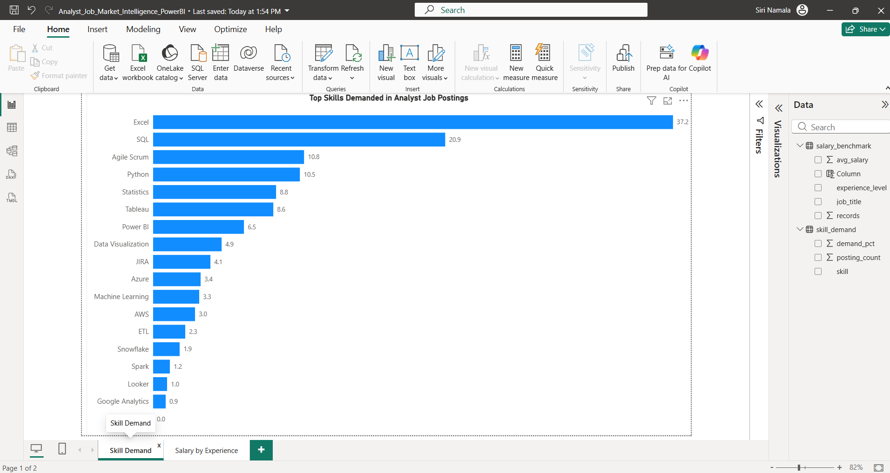
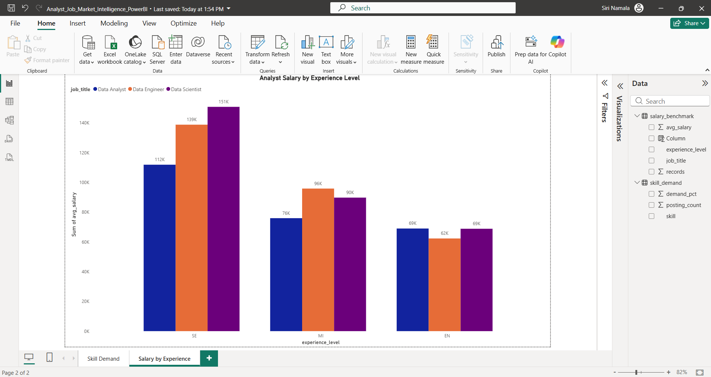

# Analyst Job Market Intelligence Dashboard

> **End-to-end job market analysis for Data & Business Analyst roles using 3,400+ real LinkedIn job postings and salary benchmark data — built with SQL, Python, Tableau Public, and Power BI.**

---

## Live Dashboard

**[View on Tableau Public →](https://public.tableau.com/app/profile/siri.namala/vizzes)**

---

## Project Overview

This project answers the questions every aspiring Data or Business Analyst is asking:

- Which skills are actually required by employers in 2024?
- Which states are hiring the most analysts?
- What does the salary landscape look like across experience levels and roles?
- Is remote work still on the table?

Instead of guessing, I built an end-to-end analysis pipeline — raw data → SQL → Python → Tableau + Power BI — to surface real, data-backed answers.

---

## Tools & Technologies

| Layer | Tools Used |
|---|---|
| Data Cleaning | Python, Pandas |
| Database | SQLite (8 analytical queries) |
| Visualization | Tableau Public, Power BI Desktop |
| Charts | Matplotlib |
| Data | LinkedIn Job Postings 2024, DS Salaries Dataset |

---

## Key Findings

- **SQL and Excel dominate** — appeared in 70%+ of analyst job postings
- **Python and Tableau** are the top differentiating technical skills (30–40% demand)
- **California, New York, and Texas** account for the largest share of analyst openings
- **Entry-level Data Analysts** average ~$72K; Senior-level crosses $110K+
- **Full-time on-site** remains the norm, but remote roles offer a salary premium

---

## Project Structure

```
analyst-job-market-intelligence/
│
├── 01_schema.sql                        # SQLite schema + views
├── 02_analysis_queries.sql              # 8 standalone analysis queries
├── 02_load_and_query.py                 # Full pipeline: load → query → export CSVs
│
├── linkedin_analyst_clean.csv           # 3,462 analyst job postings (29 columns)
├── salaries_clean.csv                   # 607 salary benchmark records
│
├── skill_demand.csv                     # Top skills % demand
├── jobs_by_state.csv                    # Job count by US state
├── experience_demand.csv                # Openings by experience level
├── salary_by_role.csv                   # Avg salary by role category
├── work_type.csv                        # Full-time / Contract / Remote split
├── salary_benchmark.csv                 # Salary by experience × role
├── skill_cooccurrence.csv               # Skills that appear together most
├── top_companies.csv                    # Top hiring companies
│
├── chart1_skill_demand.png              # Matplotlib: top skills bar chart
├── chart2_jobs_by_state.png             # Matplotlib: jobs by state
├── chart3_salary_by_experience.png      # Matplotlib: salary × experience
├── chart4_work_type.png                 # Matplotlib: work type donut
├── chart5_salary_by_role.png            # Matplotlib: salary by role
├── powerbi_page1_skill_demand.png       # Power BI: Skill Demand page
├── powerbi_page2_salary_experience.png  # Power BI: Salary by Experience page
│
└── README.md
```

---

## SQL Queries (Sample)

**Top Skills in Demand:**
```sql
SELECT skill,
       COUNT(*) AS posting_count,
       ROUND(COUNT(*) * 100.0 / (SELECT COUNT(*) FROM job_postings), 1) AS demand_pct
FROM job_skills
GROUP BY skill
ORDER BY posting_count DESC;
```

**Salary by Experience Level:**
```sql
SELECT experience_level, job_title,
       ROUND(AVG(salary_usd), 0) AS avg_salary,
       COUNT(*) AS records
FROM salary_benchmarks
WHERE salary_usd BETWEEN 30000 AND 400000
  AND job_title IN ('Data Analyst', 'Business Analyst', 'Data Scientist',
                    'Data Engineer', 'Analytics Engineer')
GROUP BY experience_level, job_title
ORDER BY job_title, avg_salary DESC;
```

All 8 queries are in [`02_analysis_queries.sql`](02_analysis_queries.sql).

---

## How to Run

```bash
# 1. Clone the repo
git clone https://github.com/sirin026/analyst-job-market-intelligence.git
cd analyst-job-market-intelligence

# 2. Install dependencies
pip install pandas matplotlib sqlite3

# 3. Run the full pipeline (loads data → runs queries → exports CSVs)
python 02_load_and_query.py
```

The script will:
- Build the SQLite database from the cleaned CSVs
- Run all 8 analysis queries and print results
- Export Tableau-ready CSVs to the `dashboard/` folder

---

## Tableau Dashboard

5 interactive sheets published on Tableau Public:

| Sheet | Chart Type | Insight |
|---|---|---|
| Top Skills in Analyst Roles | Packed Bubble | SQL, Excel, Python dominate |
| Analyst Job Demand by State | Filled Map | CA, NY, TX are hotspots |
| Job Openings by Experience Level | Treemap | Mid-level drives most demand |
| Salary Distribution by Role | Gradient Bar | Data Scientist earns highest |
| Work Type Mix | Donut Chart | Full-time on-site still leads |

**[Open Live Dashboard →](https://public.tableau.com/app/profile/siri.namala/vizzes)**

---

## Power BI Views

Two pages built in Power BI Desktop:

**Page 1 — Skill Demand**


**Page 2 — Salary by Experience Level**


File: [`Analyst_Job_Market_Intelligence_PowerBI.pbix`](Analyst_Job_Market_Intelligence_PowerBI.pbix)

---

## Data Sources

- **LinkedIn Job Postings 2024** — [Kaggle Dataset](https://www.kaggle.com/datasets/arshkon/linkedin-job-postings) — filtered to analyst roles (3,462 postings)
- **Data Science Salaries** — [Kaggle Dataset](https://www.kaggle.com/datasets/ruchi798/data-science-job-salaries) — 607 global salary records

---

## Author

**Siri Namala**
Data & Business Analyst | SQL · Python · Tableau · Power BI

[LinkedIn](https://www.linkedin.com/in/siri-namala) · [Tableau Public](https://public.tableau.com/app/profile/siri.namala/vizzes) · [GitHub](https://github.com/sirin026)
